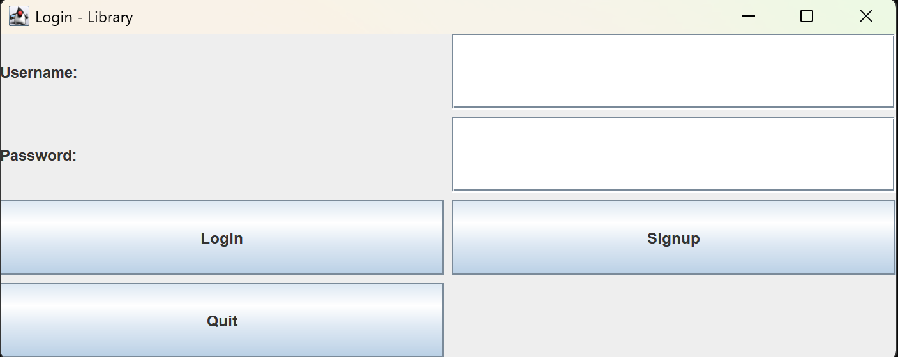
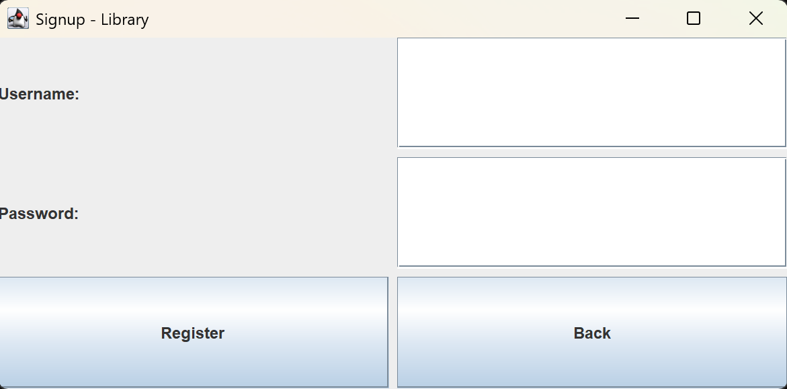
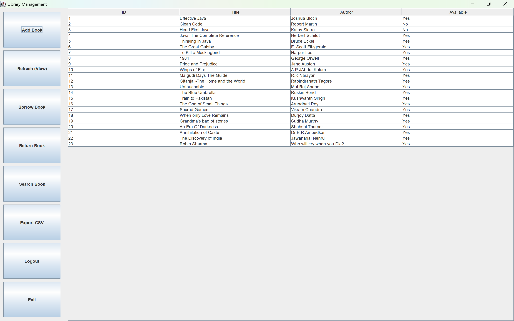
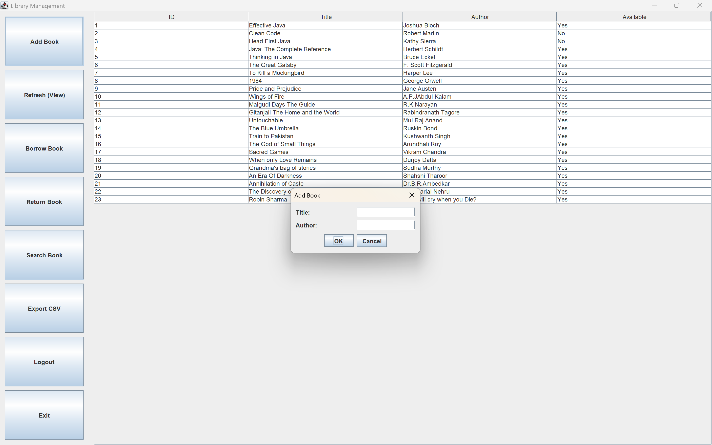
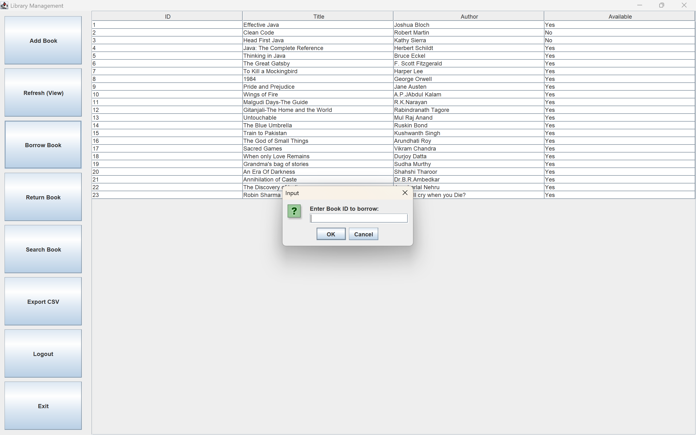
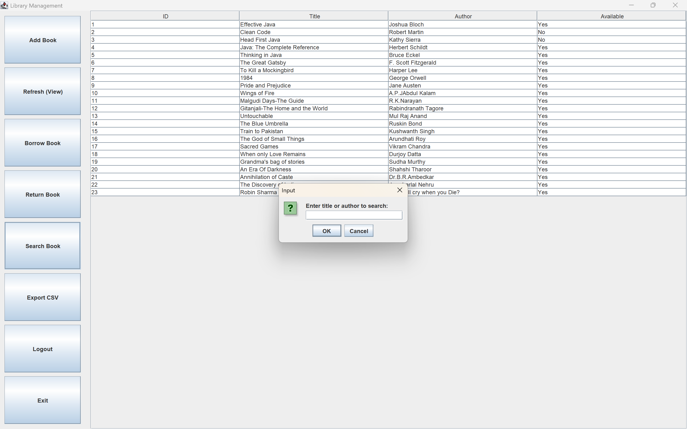
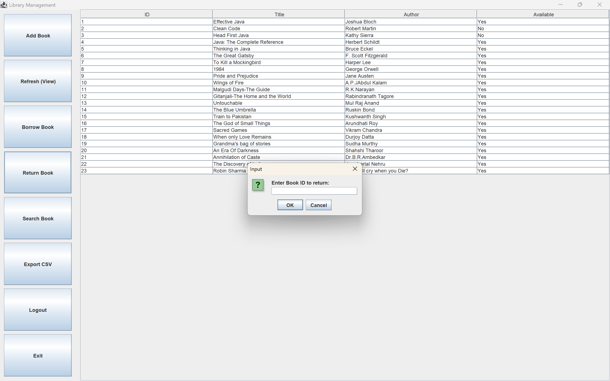

# 📚 Library Management System (Java + MySQL + Swing)

A simple **Library Management System** built using **Java Swing GUI** and **MySQL (JDBC)**.  
It allows users (librarians/members) to manage books: **Add, Borrow, Return, Search, Export to CSV**, with **Login/Signup authentication**.

---

## 🚀 Features
- 🔑 **Login & Signup** (User authentication)
- 📖 **Add Books** (with duplicate check)
- 📚 **Borrow / Return Books**
- 🔍 **Search Books** by title or author
- 📑 **View all Books** in table format
- 📤 **Export book list to CSV**
- 👨‍💻 **MySQL Database Integration** via JDBC

---

## 📸 Screenshots

### Login page

### SignUp Page

### Main GUI

### Add Book

### Borrow Book

### Search Book

### Return Book

###

---

## 🛠️ Technologies Used
- **Java (Swing GUI)**
- **MySQL Database**
- **JDBC Connector**
- **GitHub for version control**

---

## 📂 Project Structure
LibraryManagementSystem/
│-- src/ # Java source code
│ ├── LibraryGUI.java # Main GUI and logic
│ └── ...
│-- lib/ # MySQL connector JAR (optional)
│-- screenshots/ # Screenshot images
│-- README.md # Project documentation
│-- books.sql # SQL script to create DB & tables

sql
Copy code

---

## ⚙️ Setup Instructions

### 1️⃣ Database Setup (MySQL)
Run the following SQL in MySQL Workbench or CLI:

sql
CREATE DATABASE librarydb;

USE librarydb;

-- Books table
CREATE TABLE books (
    id INT AUTO_INCREMENT PRIMARY KEY,
    title VARCHAR(100) NOT NULL,
    author VARCHAR(100) NOT NULL,
    available BOOLEAN DEFAULT TRUE
);

-- Users table
CREATE TABLE users (
    id INT AUTO_INCREMENT PRIMARY KEY,
    username VARCHAR(50) UNIQUE NOT NULL,
    password VARCHAR(100) NOT NULL
);

-- Insert default admin
INSERT INTO users (username, password) VALUES ('admin', 'admin123');
2️⃣ Configure Database in Code
In LibraryGUI.java, update DB credentials:

java
Copy code
public static final String DB_URL  = "jdbc:mysql://localhost:3306/librarydb";
public static final String DB_USER = "root";           // your MySQL username
public static final String DB_PASS = "your_password";  // your MySQL password
3️⃣ Run the Project
Compile and run:

bash
Copy code
javac -cp ".;lib/mysql-connector-j-9.4.0.jar" src/LibraryGUI.java
java -cp ".;lib/mysql-connector-j-9.4.0.jar" src.LibraryGUI

👥 Contributors
Dasari Sony (Developer)

📜 License
This project is open-source and free to use.

yaml
Copy code

---

### ✅ Next Steps
1. Create a folder `screenshots/` inside your repo.  
2. Put your GUI screenshots there and rename them to match the README (`main_gui.png`, `borrow_book.png`, etc.).  
3. Commit and push the changes.  

After this, anyone visiting your repo or the **GitHub Pages URL** will see a **professional-looking live demo** of your project.  

---

